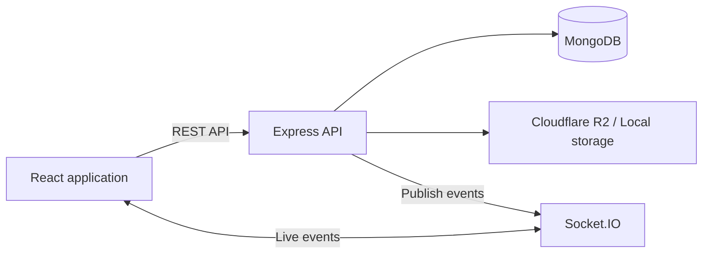

# WorkSphere

**Plan projects, manage tasks, and collaborate in real time.**

WorkSphere is a full-stack collaboration platform built with MongoDB, Express, React, and Node.js. It brings workspace membership, project planning, Kanban tasks, conversations, and shared files into one application, with Socket.IO for live updates and Cloudflare R2 for cloud file storage.

## Features

### Workspaces and projects

- Create and manage workspaces, add registered users, and assign member or manager roles.
- Organize projects with descriptions, statuses, start dates, and due dates.
- Navigate workspace members, projects, files, and chat through tabs.
- Switch between **Tasks**, **Files**, and **Chat** within a project.

### Tasks and discussions

- Create, assign, edit, and delete tasks with due dates and four priority levels.
- Work in a compact list or drag tasks across **Todo**, **In Progress**, and **Completed** Kanban columns.
- Search, filter by status, priority, assignee, or due date, and sort tasks.
- Open task cards to view details, with separate **Files** and **Comments** tabs.
- Add, edit, and delete your comments, mention members, and receive live task and comment updates.

### Realtime collaboration

- Workspace and project group chats, plus direct conversations between workspace members.
- Persisted message history with pagination, attachments, read receipts, typing indicators, and online presence.
- Member mentions through an `@email` picker.
- Direct-conversation deletion with confirmation; deletion removes messages for both participants while retaining shared workspace files.
- Notification inbox with unread counts, filtering, and individual or bulk read actions.
- Automatic room rejoining after reconnecting, with authentication and workspace access checks.

### Files and account settings

- Upload, access, and delete files attached to workspaces, projects, and tasks.
- Cloudflare R2 storage with signed access URLs, or local storage for development.
- File-type checks and a 10 MB upload limit.
- Edit your name and email, change your password using your current password, and manage your profile picture.
- Profile pictures support PNG, JPEG, and WebP up to 2 MB, with initials as a fallback.

### Visibility and administration

- Dashboard with task progress, workspace and project totals, and recent work.
- Workspace analytics with project completion, team workload, priority breakdowns, and overdue counts.
- Activity feed filtered by workspace and action type, with live updates.
- Separate admin portal for user roles and account status, workspace and project oversight, task details, comments, and activity.

## Tech stack

| Layer | Technologies |
| --- | --- |
| Frontend | React, Vite, Tailwind CSS, Redux Toolkit, React Router |
| Forms and UI | React Hook Form, Zod, Lucide React, Sonner |
| API | Node.js, Express, Axios |
| Database | MongoDB, Mongoose |
| Authentication | JSON Web Tokens, bcrypt |
| Realtime | Socket.IO, Socket.IO Client |
| File storage | Cloudflare R2, AWS SDK for S3, Multer; local filesystem fallback |
| Verification | Node.js test runner, ESLint, Vite production build |

## Architecture



Express and Socket.IO share the HTTP server started in `Backend/src/app.js`. MongoDB stores users, workspace memberships, projects, tasks, comments, messages, conversations, notifications, activities, and file metadata. File contents live in the configured storage provider.

The frontend uses shared API services, reusable UI components, and a shared chat component for workspace, project, and direct conversations. Socket subscriptions are scoped to authorized resources and cleaned up when no longer needed.

### Access and data behavior

- REST requests use a bearer token; socket connections authenticate with the same JWT.
- Protected operations check workspace membership, ownership, roles, or resource ownership as appropriate.
- Direct-message text is accessible to conversation participants who remain workspace members. **Chat attachments are workspace files** and remain visible through workspace file access.
- Adding a member grants access immediately and generates an in-app notification; there is no email invitation acceptance flow.
- Analytics date filters apply to task creation dates in UTC. Completion and overdue metrics reflect current task status and due dates.

## Run locally

### Prerequisites

- Node.js 22.12 or newer and npm.
- Git.
- A running local MongoDB instance or a MongoDB Atlas connection string.
- Cloudflare R2 credentials only if using R2 storage.

### 1. Clone and install

```bash
git clone https://github.com/Nitin-yadav2804/WorkSphere.git
cd WorkSphere
npm ci --prefix Backend
npm ci --prefix Frontend
```

### 2. Configure the backend

Create `Backend/.env`:

```dotenv
PORT=3000
MONGO_URI=mongodb://127.0.0.1:27017/worksphere
JWT_SECRET=replace_with_a_long_random_secret
FRONTEND_URL=http://localhost:5173
STORAGE_PROVIDER=local
```

For MongoDB Atlas, replace `MONGO_URI` with your connection string. Local uploads are stored in `Backend/uploads`.

To use Cloudflare R2, replace the storage setting and add these backend variables:

```dotenv
STORAGE_PROVIDER=r2
R2_ACCOUNT_ID=your_cloudflare_account_id
R2_ACCESS_KEY_ID=your_r2_access_key_id
R2_SECRET_ACCESS_KEY=your_r2_secret_access_key
R2_BUCKET_NAME=your_r2_bucket_name
```

Keep `.env` files and credentials out of version control. R2 credentials belong only on the backend.

### 3. Configure the frontend

The frontend defaults to `http://localhost:3000`. To use a different backend, create `Frontend/.env`:

```dotenv
VITE_API_URL=http://localhost:3000
```

Use the backend origin **without `/api` or a trailing slash**. The frontend appends `/api` for REST requests and uses the origin for Socket.IO.

### 4. Start both applications

In one terminal, from the repository root:

```bash
npm start --prefix Backend
```

For automatic backend restarts while developing, use `npm run dev --prefix Backend`.

In a second terminal:

```bash
npm run dev --prefix Frontend
```

Open [WorkSphere locally](http://localhost:5173). The backend runs at [localhost:3000](http://localhost:3000), with REST endpoints under `/api`.

### Try the collaboration workflow

1. Register two accounts in separate browser sessions.
2. Create a workspace and add the second account as a member.
3. Create a project, assign a task, and move it through the Kanban columns.
4. Open the task to add a comment, mention a member, and upload a file.
5. Send workspace, project, or direct messages and view live updates in the other session.
6. Review notifications, activity, and analytics.

## Project structure

```text
WorkSphere/
├── Backend/
│   ├── src/
│   │   ├── config/          # Database connection
│   │   ├── controllers/     # Request handlers, including admin operations
│   │   ├── middleware/      # Authentication, roles, uploads, and errors
│   │   ├── models/          # Mongoose models
│   │   ├── realtime/        # Socket server and event publishing
│   │   ├── routes/          # REST endpoints
│   │   ├── services/        # Shared collaboration logic
│   │   ├── utils/           # Access checks, storage, and lifecycle helpers
│   │   ├── validators/      # Request schemas
│   │   └── app.js           # Express and Socket.IO startup
│   └── tests/
├── Frontend/
│   ├── src/
│   │   ├── components/      # Shared UI, forms, files, chat, and task board
│   │   ├── hooks/           # Shared React hooks
│   │   ├── layouts/         # User and admin layouts
│   │   ├── pages/           # Application screens
│   │   ├── routes/          # Routing and route guards
│   │   ├── services/        # API and socket clients
│   │   ├── store/           # Redux state
│   │   └── utils/           # Shared formatting and UI helpers
│   ├── tests/
│   └── vercel.json          # SPA routing configuration
└── README.md
```

## API overview

All paths below are relative to `/api`. Protected endpoints require `Authorization: Bearer <token>`.

| Area | Routes |
| --- | --- |
| Authentication | `/auth/register`, `/auth/login`, `/auth/profile`, `/auth/password` |
| Workspaces and members | `/workspaces`, `/workspaces/:workspaceId`, `/workspaces/:workspaceId/members` |
| Projects | `/workspaces/:workspaceId/projects`, `/projects/:projectId` |
| Tasks and comments | `/projects/:projectId/tasks`, `/tasks/:taskId`, `/tasks/:taskId/comments`, `/comments/:commentId` |
| Files | `/files/upload`, `/files/workspace/:workspaceId`, `/files/project/:projectId`, `/files/task/:taskId`, `/files/:fileId/access`, `/files/:fileId/download`, `/files/:fileId` |
| Group chat | `/workspaces/:workspaceId/messages`, `/projects/:projectId/messages` |
| Direct chat | `/conversations`, `/conversations/:id` (DELETE), `/conversations/:conversationId/messages` |
| Read receipts | `/chat/:kind/:id/read` |
| Notifications | `/notifications`, `/notifications/read` |
| Activity and analytics | `/workspaces/:workspaceId/activities`, `/workspaces/:workspaceId/analytics` |
| Profile pictures | `/images/user/:id/image` |
| Administration | `/admin/*` |

Request methods, validation, and access requirements are defined in `Backend/src/routes` and the associated controllers and services.

## Tests and build

Run from the repository root:

```bash
npm test --prefix Backend
npm test --prefix Frontend
npm run build --prefix Frontend
```

The test suites cover shared validation and UI helpers, authorization, chat isolation, notification delivery, conversation deletion, missing profile images, error responses, and local file cleanup. They use mocked database operations; local file lifecycle checks use the filesystem. These checks do not replace deployed browser testing or live R2 integration checks.

The frontend also includes a lint command:

```bash
npm run lint --prefix Frontend
```

## Deployment configuration

### Frontend

The repository includes a Vercel SPA rewrite configuration in `Frontend/vercel.json`.

- Project root: `Frontend`
- Build command: `npm run build`
- Output directory: `dist`
- Environment variable: `VITE_API_URL`, set to the backend origin.

### Backend

The backend starts a persistent HTTP server with Socket.IO. Deploy it to a Node.js runtime that supports long-lived socket connections and run `node src/app.js` from `Backend` after installing dependencies.

Set `MONGO_URI`, `JWT_SECRET`, `FRONTEND_URL`, and the storage variables on the backend. `FRONTEND_URL` must match the frontend's exact origin. Optional `FRONTEND_URLS` accepts a comma-separated list of additional origins for both REST and Socket.IO. Use R2 for cloud uploads when local disk persistence is unavailable.

Realtime room state currently lives in one backend process. A multi-instance deployment requires a shared Socket.IO adapter and appropriate connection routing. After deployment, verify login, reconnects, two-account collaboration, and file access against the deployed services.

## Author

Built by **Nitin Yadav**.

[GitHub profile](https://github.com/Nitin-yadav2804) · [Repository](https://github.com/Nitin-yadav2804/WorkSphere)
